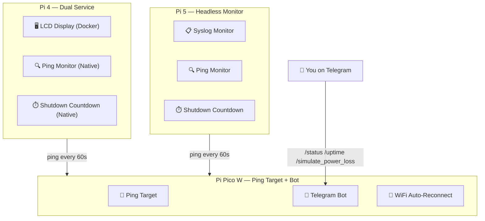
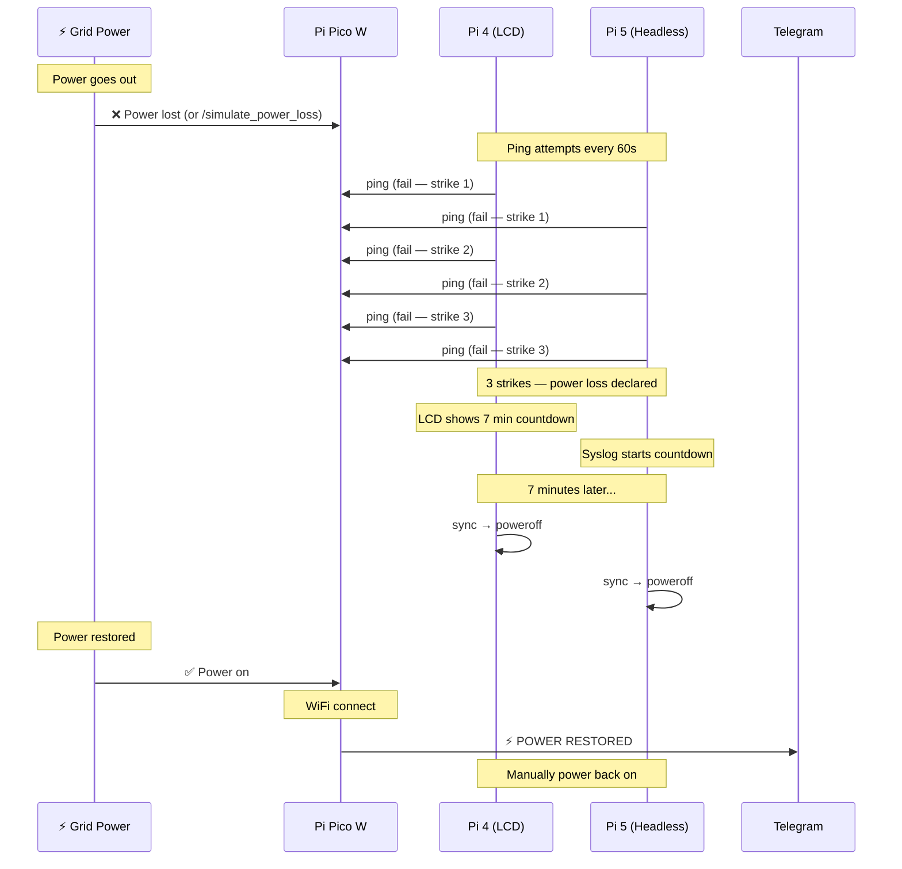
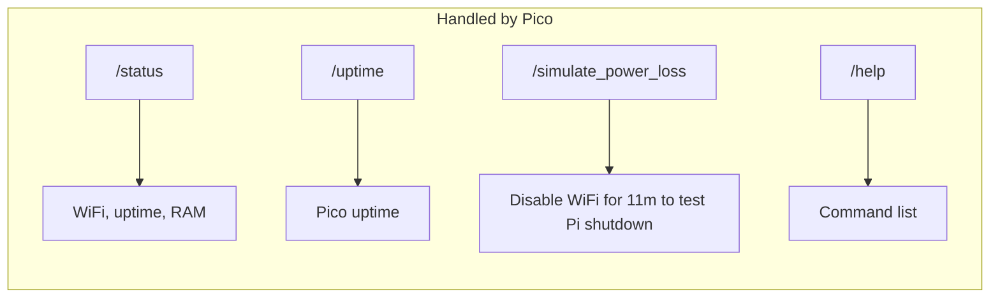

# Home-Mesh — UPS-Aware Power Monitoring System

A three-device power monitoring and management system for a Raspberry Pi homelab, designed to gracefully shut down NVMe-equipped Pi's during extended power outages and trigger shutdowns cleanly via ping tracking.

## Architecture



## Power Failure Timeline



## Telegram Commands



## Setup

### 1. Pi Pico W

```bash
# 1. Copy config template and fill in your values
cp PiPico/config.example.json PiPico/config.json
# Edit config.json with your WiFi and Telegram details

# 2. Build a standalone main.py with secrets baked in
python3 PiPico/build.py
# This produces PiPico/main_built.py (gitignored)

# 3. Flash to Pico W using Thonny
# In Thonny:
#   - Set interpreter to MicroPython (Raspberry Pi Pico)
#   - Upload PiPico/main_built.py to the Pico as "main.py"
#   - Upload PiPico/boot.py to the Pico as "boot.py"
#   - No need to upload config.json — values are baked into main_built.py
```

### 2. Pi 4 (Dual Service: Power Monitor + LCD)

Because safely shutting down the host system from within a Docker container is insecure and hacky, the Pi 4 uses a clean separation of concerns:

#### Part A: Power Monitor (Native Systemd)
```bash
cd ~/Projects/home-mesh/Pi4LCD

# Create config
cp ../config.example.ini config.ini
# Edit config.ini — set identity.name = pi4

# Install systemd service
sudo cp power-monitor.service /etc/systemd/system/
sudo systemctl daemon-reload
sudo systemctl enable power-monitor.service
sudo systemctl start power-monitor.service
```

#### Part B: LCD Display (Dockerized)
The LCD requires the `RPLCD` library, which we run in Docker to avoid system Python environment conflicts (`PEP 668`).

```bash
# Build and run the container in the background
docker compose up -d --build
```

### 3. Pi 5 (Headless Monitor)

```bash
cd ~/Projects/home-mesh/Pi5

# Create config
cp ../config.example.ini config.ini
# Edit config.ini — set identity.name = pi5

# Install systemd service
sudo cp power-monitor.service /etc/systemd/system/
sudo systemctl daemon-reload
sudo systemctl enable power-monitor.service
sudo systemctl start power-monitor.service
```

## Configuration

### Pi 4 / Pi 5 — `config.ini`

```ini
[network]
pico_ip = 192.168.0.107

[power]
ping_interval_sec = 60
max_failed_pings = 3
shutdown_countdown_min = 7
ping_timeout_sec = 5

[identity]
name = pi4   # or pi5
```

### Pico W — `config.json`

```json
{
    "wifi_ssid": "YOUR_SSID",
    "wifi_password": "YOUR_PASSWORD",
    "bot_token": "YOUR_BOT_TOKEN",
    "chat_id": "YOUR_CHAT_ID"
}
```

## File Structure

```
home-mesh/
├── .gitignore
├── README.md
├── config.example.ini          # Template for Pi 4/Pi 5
├── PiPico/
│   ├── main.py                 # Telegram bot + ping target
│   ├── boot.py                 # MicroPython auto-start
│   ├── config.example.json     # Template
│   ├── build.py                # script to compile secrets into main.py
│   └── config.json             # Secrets (gitignored)
├── Pi4LCD/
│   ├── power_monitor.py        # Native power monitor (same as Pi5)
│   ├── lcd_display.py          # Dockerized LCD stats display
│   ├── Dockerfile              # Docker environment for LCD
│   ├── docker-compose.yml      # Compose file for easy deployment
│   ├── lcd_message.py          # One-shot LCD message utility
│   ├── power-monitor.service   # Native systemd unit
│   ├── requirements.txt
│   └── config.ini              # Secrets (gitignored)
├── Pi5/
│   ├── power_monitor.py        # Headless power monitor
│   ├── power-monitor.service   # systemd unit
│   └── config.ini              # Secrets (gitignored)
└── legacy/                     # Archived C code and old scripts (gitignored)
```

## Security Notes

- **All secrets** (Telegram tokens, WiFi passwords) are in gitignored config files
- **Telegram commands** are validated against `chat_id` — unauthorized users are ignored
- The `legacy/` directory is gitignored and won't be pushed
