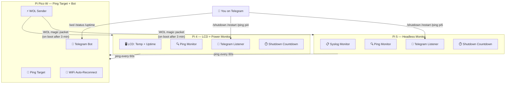
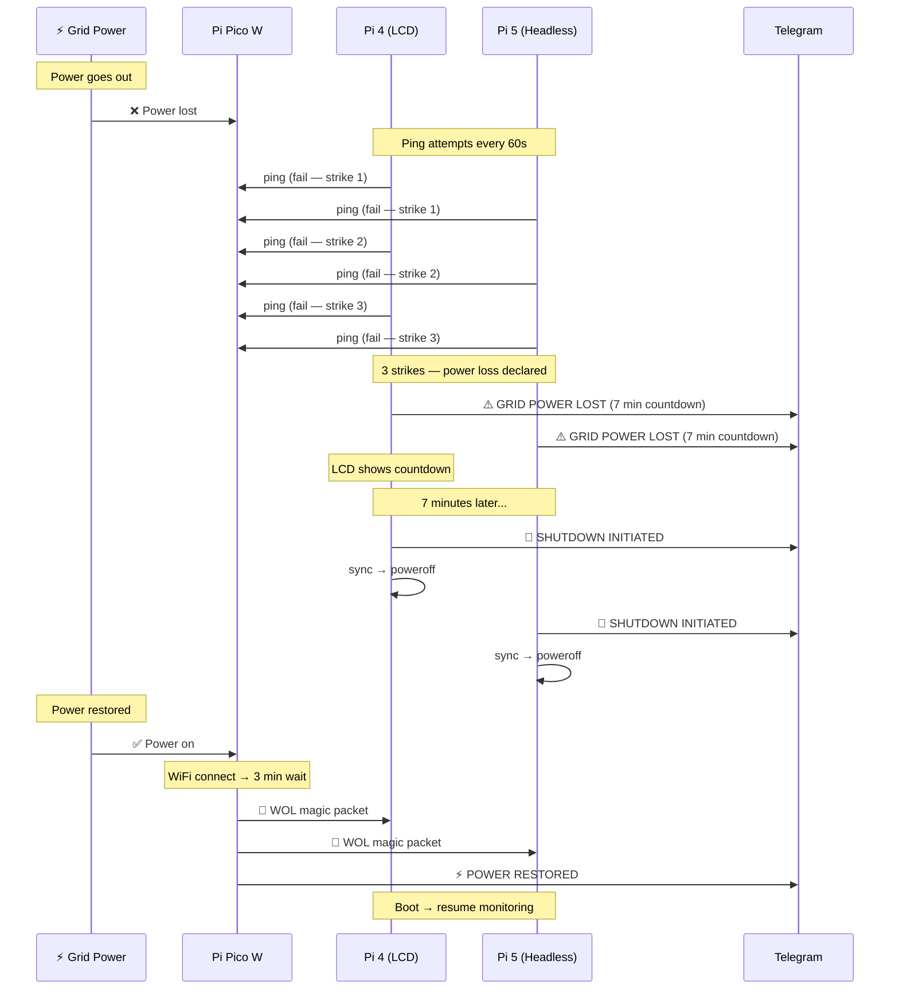
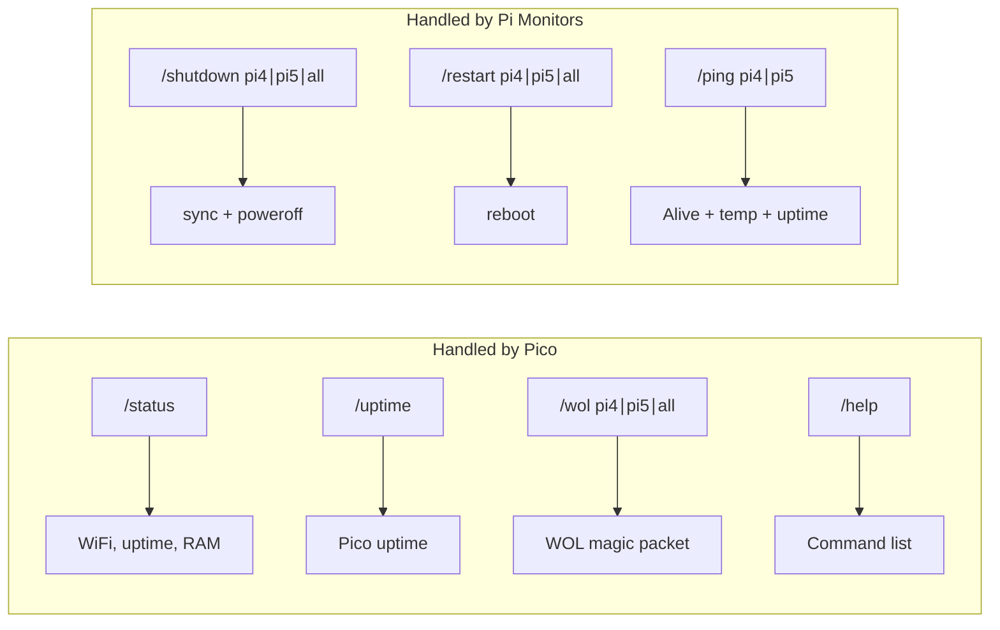

# Home-Mesh — UPS-Aware Power Monitoring System

A three-device power monitoring and management system for a Raspberry Pi homelab, designed to gracefully shut down NVMe-equipped Pi's during extended power outages and wake them back up when power returns.

## Architecture



## Power Failure Timeline



## Telegram Commands



## Setup

### 1. Pi Pico W

```bash
# Copy config template and fill in your values
cp PiPico/config.example.json PiPico/config.json
# Edit config.json with your WiFi, Telegram, and MAC addresses

# Flash to Pico W using Thonny or mpremote:
#   - Upload main.py, boot.py, and config.json to the Pico's filesystem
```

### 2. Pi 4 (LCD + Power Monitor)

```bash
# Install dependencies
pip install -r Pi4LCD/requirements.txt

# Create config
cp config.example.ini Pi4LCD/config.ini
# Edit Pi4LCD/config.ini — set identity.name = pi4

# Install systemd service
sudo cp Pi4LCD/power-monitor.service /etc/systemd/system/
sudo systemctl daemon-reload
sudo systemctl enable power-monitor.service
sudo systemctl start power-monitor.service

# Enable WOL
sudo bash shared/setup_wol.sh
# Note the MAC address printed — add it to Pico's config.json as pi4_mac
```

### 3. Pi 5 (Headless Monitor)

```bash
# Install dependencies
pip install -r Pi5/requirements.txt

# Create config
cp config.example.ini Pi5/config.ini
# Edit Pi5/config.ini — set identity.name = pi5

# Install systemd service
sudo cp Pi5/power-monitor.service /etc/systemd/system/
sudo systemctl daemon-reload
sudo systemctl enable power-monitor.service
sudo systemctl start power-monitor.service

# Enable WOL
sudo bash shared/setup_wol.sh
# Note the MAC address printed — add it to Pico's config.json as pi5_mac
```

### 4. One-Shot LCD Message (Pi 4)

```bash
# Display a temporary message on the LCD (stops monitor, restarts on exit)
sudo python3 Pi4LCD/lcd_message.py "Hello World" "Line 2" 30
sudo python3 Pi4LCD/lcd_message.py "Single|Line" 10
```

## Configuration

### Pi 4 / Pi 5 — `config.ini`

```ini
[telegram]
bot_token = YOUR_BOT_TOKEN
chat_id = YOUR_CHAT_ID

[network]
pico_ip = 192.168.0.107

[power]
ping_interval_sec = 60
max_failed_pings = 3
shutdown_countdown_min = 7
ping_timeout_sec = 5

[identity]
name = pi4   # or pi5
```

### Pico W — `config.json`

```json
{
    "wifi_ssid": "YOUR_SSID",
    "wifi_password": "YOUR_PASSWORD",
    "bot_token": "YOUR_BOT_TOKEN",
    "chat_id": "YOUR_CHAT_ID",
    "pi4_mac": "AA:BB:CC:DD:EE:F1",
    "pi5_mac": "AA:BB:CC:DD:EE:F2",
    "wol_boot_delay_sec": 180
}
```

## File Structure

```
home-mesh/
├── .gitignore
├── README.md
├── config.example.ini          # Template for Pi 4/Pi 5
├── PiPico/
│   ├── main.py                 # Telegram bot + WOL + ping target
│   ├── boot.py                 # MicroPython auto-start
│   ├── config.example.json     # Template
│   └── config.json             # Secrets (gitignored)
├── Pi4LCD/
│   ├── power_monitor.py        # LCD stats + power monitor
│   ├── lcd_message.py          # One-shot LCD message utility
│   ├── power-monitor.service   # systemd unit
│   ├── requirements.txt
│   └── config.ini              # Secrets (gitignored)
├── Pi5/
│   ├── power_monitor.py        # Headless power monitor
│   ├── power-monitor.service   # systemd unit
│   ├── requirements.txt
│   └── config.ini              # Secrets (gitignored)
├── shared/
│   └── setup_wol.sh            # WOL setup for Pi's
└── legacy/                     # Archived C code and old scripts (gitignored)
```

## Security Notes

- **All secrets** (Telegram tokens, WiFi passwords, chat IDs) are in gitignored config files
- **Telegram commands** are validated against `chat_id` — unauthorized users are ignored
- The `legacy/` directory is gitignored and won't be pushed
