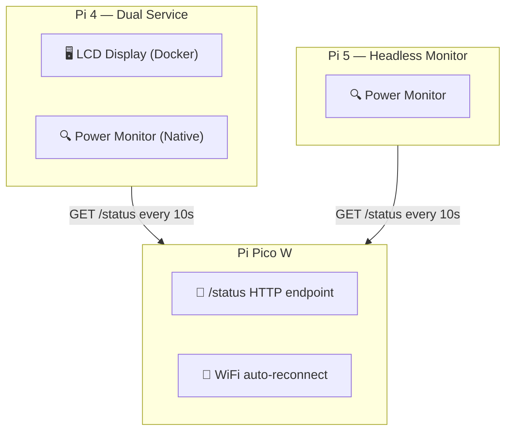
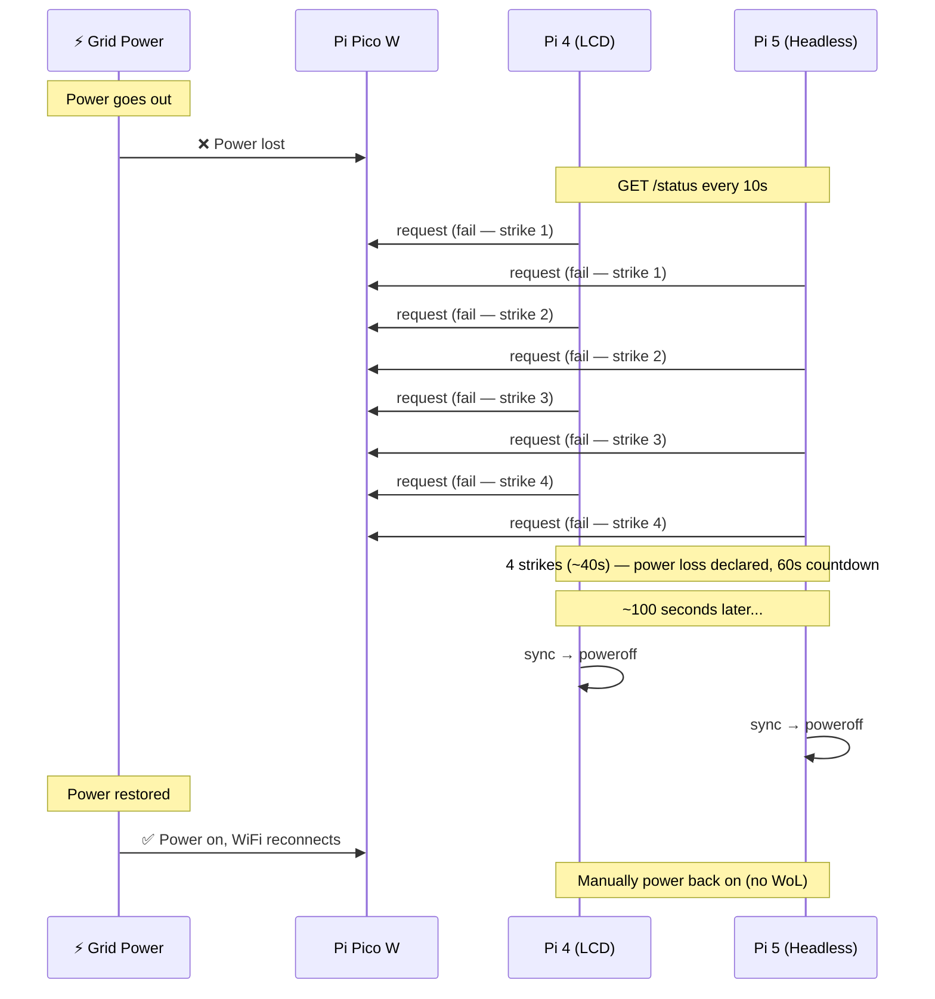

# Home-Mesh — UPS-Aware Power Monitoring System

A three-device power monitoring system for a Raspberry Pi homelab: the Pico W
reports its own status over HTTP, the Pi 4 and Pi 5 poll it and gracefully
shut themselves down during extended power outages.

Wake-on-LAN / power-on automation was tried and abandoned (see
`Pi4LCD/GiveUp.md`) — the Pi 4's Ethernet chip loses power on halt, so it
can't receive a magic packet. Nothing here attempts power-on; only the
power-off side is implemented.

## Architecture


```mermaid
graph TD
    subgraph PICO["Pi Pico W"]
        P1["📡 /status HTTP endpoint"]
        P4["📶 WiFi auto-reconnect"]
    end

    subgraph PI4["Pi 4 — Dual Service"]
        L1["🖥️ LCD Display (Docker)"]
        L2["🔍 Power Monitor (Native)"]
    end

    subgraph PI5["Pi 5 — Headless Monitor"]
        H2["🔍 Power Monitor"]
    end

    PI4 -- "GET /status every 10s" --> PICO
    PI5 -- "GET /status every 10s" --> PICO
```

## Power Failure Timeline


```mermaid
sequenceDiagram
    participant Grid as ⚡ Grid Power
    participant Pico as Pi Pico W
    participant Pi4 as Pi 4 (LCD)
    participant Pi5 as Pi 5 (Headless)

    Note over Grid: Power goes out
    Grid->>Pico: ❌ Power lost

    Note over Pi4,Pi5: GET /status every 10s
    Pi4->>Pico: request (fail — strike 1)
    Pi5->>Pico: request (fail — strike 1)
    Pi4->>Pico: request (fail — strike 2)
    Pi5->>Pico: request (fail — strike 2)
    Pi4->>Pico: request (fail — strike 3)
    Pi5->>Pico: request (fail — strike 3)
    Pi4->>Pico: request (fail — strike 4)
    Pi5->>Pico: request (fail — strike 4)

    Note over Pi4,Pi5: 4 strikes (~40s) — power loss declared, 60s countdown

    Note over Pi4,Pi5: ~100 seconds later...
    Pi4->>Pi4: sync → poweroff
    Pi5->>Pi5: sync → poweroff

    Note over Grid: Power restored
    Grid->>Pico: ✅ Power on, WiFi reconnects
    Note over Pi4,Pi5: Manually power back on (no WoL)
```

## Pico `/status` Endpoint

Any device on the LAN can query it directly:

```bash
curl http://<pico-ip>/status
```

```json
{"uptime_s": 1234, "wifi_connected": true, "rssi": -52, "last_outage_s": 8}
```

- `uptime_s` — seconds since the Pico last booted
- `wifi_connected` / `rssi` — current WiFi link status
- `last_outage_s` — how long the *previous* WiFi drop lasted (`null` if it hasn't dropped since boot)

This is what the Pi 4/5 monitors poll to decide whether the Pico (and by
extension, the grid) is up.

## Setup

### 1. Pi Pico W

```bash
# 1. Copy config template and fill in your WiFi details
cp PiPico/config.example.json PiPico/config.json

# 2. Upload both files to the Pico (e.g. with mpremote from a venv)
mpremote cp PiPico/config.json :config.json
mpremote cp PiPico/main.py :main.py
mpremote reset
```

No `boot.py` and no build step — `main.py` runs automatically on boot, and
`config.json` holds only WiFi credentials (already gitignored).

### 2. Pi 4 (Dual Service: Power Monitor + LCD)

Because safely shutting down the host system from within a Docker container is insecure and hacky, the Pi 4 uses a clean separation of concerns:

#### Part A: Power Monitor (Native Systemd)
```bash
cd ~/Projects/home-mesh

# Create config
cp config.example.ini Pi4LCD/config.ini
# Edit Pi4LCD/config.ini — set identity.name = pi4, network.pico_ip = <pico's IP>

# Install systemd service (edit the ExecStart paths in the .service file
# first if your checkout isn't at the path it already points to)
sudo cp Pi4LCD/power-monitor.service /etc/systemd/system/
sudo systemctl daemon-reload
sudo systemctl enable --now power-monitor.service
```

#### Part B: LCD Display (Dockerized)
The LCD requires the `RPLCD` library, which we run in Docker to avoid system Python environment conflicts (`PEP 668`).

```bash
cd Pi4LCD
docker compose up -d --build
```

### 3. Pi 5 (Headless Monitor)

```bash
cd ~/Projects/home-mesh

# Create config
cp config.example.ini Pi5/config.ini
# Edit Pi5/config.ini — set identity.name = pi5, network.pico_ip = <pico's IP>

sudo cp Pi5/power-monitor.service /etc/systemd/system/
sudo systemctl daemon-reload
sudo systemctl enable --now power-monitor.service
```

`power_monitor.py` lives once at the repo root and is shared by both
devices; each systemd unit passes it that device's own `config.ini` as an
argument. To test without risking an actual shutdown, run it manually with
`POWER_MONITOR_DRY_RUN=1 python3 power_monitor.py Pi5/config.ini` — it logs
what it would do instead of calling `systemctl poweroff`.

## Configuration

### Pi 4 / Pi 5 — `config.ini`

```ini
[network]
pico_ip = 192.168.0.107

[power]
ping_interval_sec = 10
ping_timeout_sec = 3
max_failed_pings = 4
shutdown_countdown_sec = 60

[identity]
name = pi4   # or pi5
```

Timing is built around a UPS that only lasts **3-5 minutes**:
`detection_time ≈ ping_interval_sec × max_failed_pings` (40s with the
defaults above), then `shutdown_countdown_sec` (60s) before `poweroff` runs
— about 1m40s total, leaving margin for the Pi's own shutdown time. Tune
both numbers to your actual measured UPS runtime; keep the total well under
it.

### Pico W — `config.json`

```json
{
    "wifi_ssid": "YOUR_SSID",
    "wifi_password": "YOUR_PASSWORD"
}
```

Give the Pico a static IP or DHCP reservation — if its address drifts, both
Pis will wrongly declare power loss and shut down.

## File Structure

```
home-mesh/
├── .gitignore
├── README.md
├── config.example.ini          # Template for Pi 4/Pi 5
├── power_monitor.py            # Shared power monitor (takes a config.ini path as argv[1])
├── PiPico/
│   ├── main.py                 # WiFi + /status HTTP responder
│   └── config.example.json     # Template
├── Pi4LCD/
│   ├── lcd_display.py          # Dockerized LCD stats display
│   ├── Dockerfile
│   ├── docker-compose.yml
│   ├── lcd_message.py          # One-shot LCD message utility
│   ├── power-monitor.service   # Native systemd unit
│   ├── requirements.txt
│   ├── GiveUp.md                # Why Wake-on-LAN doesn't work on the Pi 4
│   └── config.ini              # Secrets (gitignored)
├── Pi5/
│   ├── power-monitor.service   # systemd unit
│   └── config.ini              # Secrets (gitignored)
└── legacy/                     # Archived C code and old scripts (gitignored)
```

## Security Notes

- **All secrets** (WiFi password) are in gitignored config files
- The `legacy/` directory is gitignored and won't be pushed
